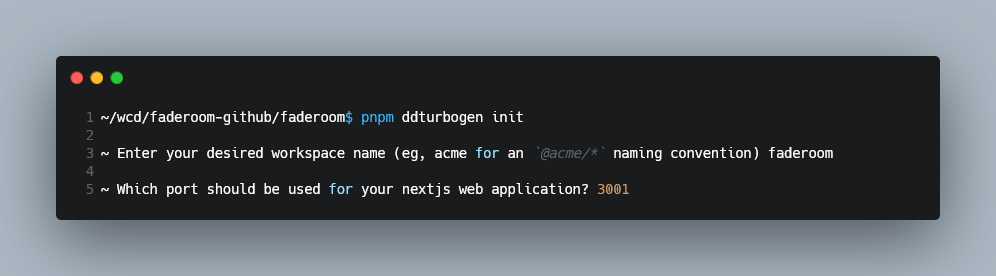

# @d0paminedriven/turbogen

Generate a pnpm workspace powered by turborepo ft essential tooling repos as workspace packages and a nextjs web app starter as icing on the cake

Simply run `pnpm ddturobgen init` from your cli

### Installation

```bash
pnpm install @d0paminedriven/turbogen
```

### Usage

```bash
pnpm ddturbogen init
```

Run `pnpm init` in a new repo and install the package. 


Once installed, your `package.json` file should look similar to the following


Now run the `pnpm ddturbogen init` command (ddturbogen is short for dopamine driven turbogen 🌚)

There are two prompts to answer, shown below





Once finished, your entire workspace is instantly generated, tooling is configured, and a web app is ready to go. Your locally installed version of pnpm is also parsed and included in your root `package.json` file

Now, your root `package.json` should look similar to the following


### An important Final step -- run install again from the root

I recommend using the generated corepack script to keep pnpm running at its latest version by running

```bash
pnpm latest:pnpm
```

The command being executed here is

```bash
corepack use pnpm@latest
```

after the corepack command has been run the `packageManager` field in your `package.json` file should look similar to the following

```json
{
  "packageManager": "pnpm@9.13.2+sha512.88c9c3864450350e65a33587ab801acf946d7c814ed1134da4a924f6df5a2120fd36b46aab68f7cd1d413149112d53c7db3a4136624cfd00ff1846a0c6cef48a",
}
```

This also recursively runs an install for all dependencies in your workspace

### The `tooling` packages

Each package in the tooling directory is a local workspace-only package. These include eslint, jest, prettier, and typescript utilities

Notice that in your root `package.json` file three of the four packages are referenced in your `devDependencies` (faderoom just happens to be the name I used for this workspace)

```json

{
  "devDependencies": {
    "@faderoom/eslint-config": "workspace:*",
    "@faderoom/prettier-config": "workspace:*",
    "@faderoom/tsconfig": "workspace:*"
  }
}
```


### Run the web app from the get-go

After successfully installing your dependencies by running `pnpm install` or `pnpm latest:pnpm` from the root, run the command to fire up the dev server of the nextjs web app

```bash
pnpm run:web
```


